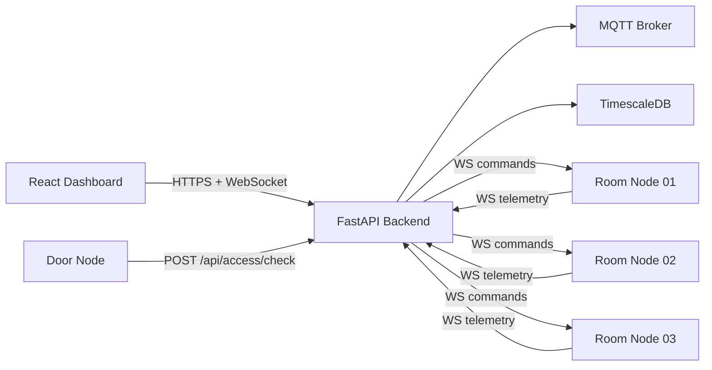
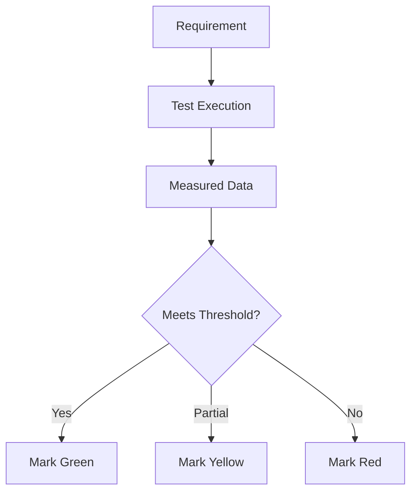
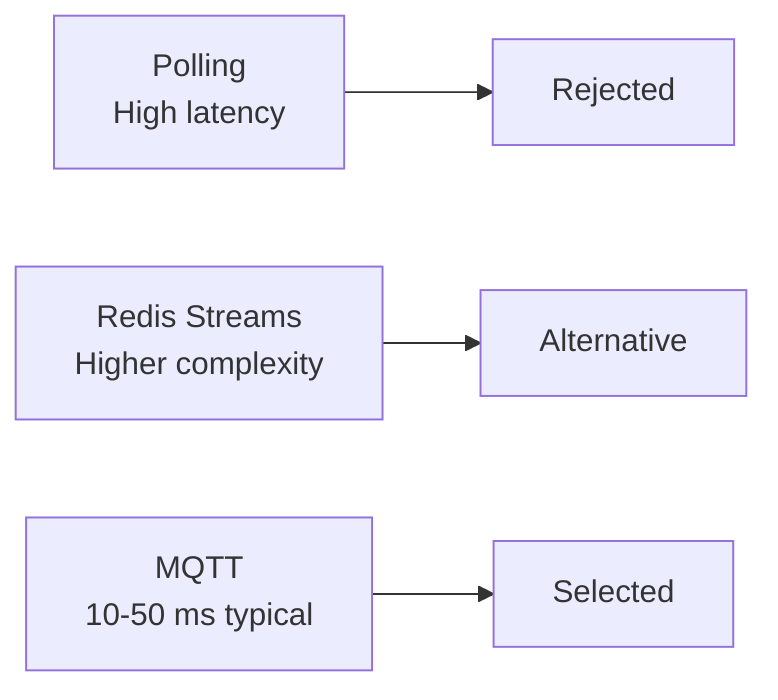
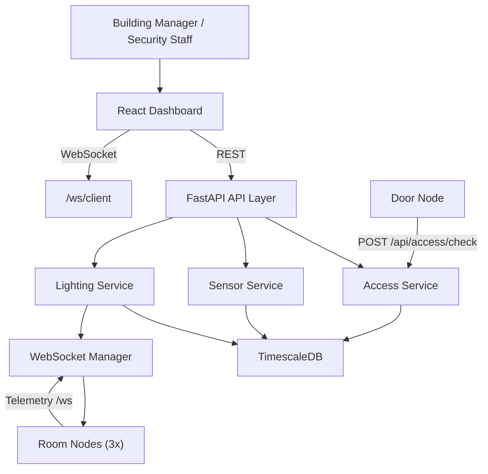
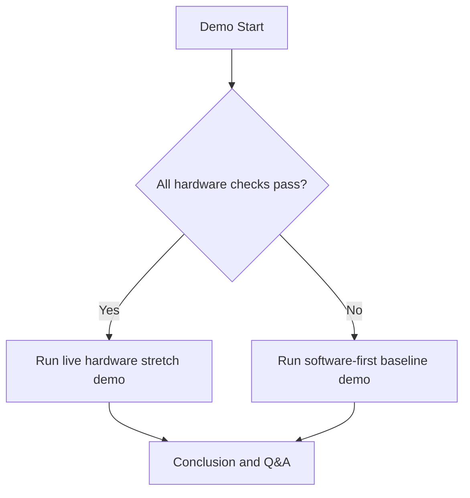

# Smart Home Final Presentation Playbook (Specific Version)

This revision adds exact slide content, formatting rules, runnable test commands, concrete data to show, and paste-ready mermaid diagrams.

Primary references used:
- `docs/7_FinalPresentationGuidance.pdf`
- `docs/Team_A4_Belmonte_Chen_design_report.pdf`
- `docs/Capstone Ghantt Chart - Sheet1.pdf`
- Weekly status reports (Team, Mario, Cindy): [Team A4 course site](https://course.ece.cmu.edu/~ece500/projects/s26-teama4/)
- `docs/INTEGRATION_STATUS.md`
- `docs/INTEGRATION_EVIDENCE.md`
- `docs/WIRING_AUDIT.md`
- `docs/DEMO.md`

---

## 1) Hard Constraints and Slide Style

### Required constraints
- Max 12 slides.
- 12-minute presentation + Q&A (your instructor template may specify **3 minutes Q&A**; confirm against the slide deck you were given).
- Slide 1 must contain team name, team number, all team members, presenter.
- Strong conclusion slide; do not end with a blank "Questions?" slide.

### Recommended formatting template (apply to every slide)
- Title: 36-44 pt.
- Body text: 24-28 pt.
- Tables: minimum 18 pt.
- Max 6 bullets per slide, max 10 words per bullet.
- Use one key visual per slide; avoid text-only slides.
- Color convention:
  - Green: verified/proven.
  - Yellow: partially verified.
  - Red: pending/open risk.

### Timing plan
| Slides | Time |
|---|---|
| 1-2 | 1:40 |
| 3-4 | 1:45 |
| 5-7 | 4:15 |
| 8-10 | 2:30 |
| 11-12 | 1:30 |
| Buffer | 0:20 |

---

## 2) Narrative You Should Commit To

Use this exact throughline:

1. We built the software platform and integration backbone.
2. We have quantitative requirements and evidence for many software-level claims.
3. Remaining risk is hardware wiring/safety closure and full hardware-in-loop validation.
4. We have a 4-day, checkpoint-based closure plan.

Do not claim "fully complete hardware integration" until physically validated.

---

## 2b) Work split — what each person did (from weekly status reports)

Use this on **Slide 9** (Project Management) to satisfy **“WHO did WHAT.”** Bullets below summarize recurring themes across [Team A4 weekly reports](https://course.ece.cmu.edu/~ece500/projects/s26-teama4/) (Feb–Apr 2026); wording is aligned with how you already described ownership in the design report and Gantt.

### Mario Belmonte — primary contributions (software / integration / demo UX)

| Area | What you reported doing |
|---|---|
| Backend and Pi | Stabilized **Python `venv` and `requirements.txt`** on Raspberry Pi 5 so installs complete cleanly; prepared **config/env** for integration and flashing workflows. |
| Stack integration | Fixed **database + MQTT** connectivity so backend services communicate reliably; clarified **Docker / service dependencies** in the pipeline. |
| Documentation and repo | **Refactored** codebase toward the current web-first use case; updated **README** and improved **wiring documentation** for safer bring-up. |
| Validation | Ran **software pipeline tests** before attaching live hardware; **sorted materials against BOM**; researched **power/grounding and electrical safety** for integration. |
| Dashboard and demo UX | Improved **dashboard metric legibility**; separated **Demo Mode vs Live Mode**; added **12-hour simulated telemetry** for stakeholder demos; **custom rule creation** (team report 4/18). |
| Firmware tooling | **Flashed ESP32-S3**, resolved **toolchain/dependency** issues; verified **API ports** via **health checks**. |
| Deliverables | Built **final presentation slideshow**; started **final written report** (status report 4/18). |

### Cindy Chen — primary contributions (hardware / firmware bring-up / physical demo)

| Area | What she reported doing |
|---|---|
| Firmware and bring-up | Focus on **`firmware/room-node`**: sensor init, Wi‑Fi/WebSocket, telemetry, dimmer/fan/relay commands (validation blocked until Pi backend stable — team report 3/21). |
| Interim demo hardware | **Wired and staged** environmental node (BME280 + BH1750 in interim demo narrative) and **door node** (RC522, relay, solenoid); **staged tests** (I2C/scanner, RFID-only, relay-only, combined authorized UID). |
| Debug and safety during bring-up | Resolved **breadboard/pin/relay** issues; **relay verified before lock**; **flyback/diode** path emphasized in team narratives; ESP32-S3 pin checks. |
| Physical model | Built **interim model house**; progressed **final house** via **CAD/laser cutting**, **room-by-room layout**, planning **acrylic** for visibility; **completed model house** for demo context (team + Mario reports 4/18). |
| Procurement and integration planning | **Ordered** remaining parts for actuation/lighting/fan expansion; **node compatibility / combined-load stress testing**; planned **compact MCU packaging** per room for mounting. |

**Consistency note for slides:** Several weekly reports describe the interim environmental demo node as **BME280 + BH1750**, while other repository documents standardize on **TEMT6000** for ambient light. When you speak or label screenshots, pick **one** story: either “interim bench demo used BH1750 (per status reports), final integration follows `docs/WIRING.md`,” or align all visuals to the final sensor choice so slides do not contradict each other.

### Joint / explicit handoffs (say this in one sentence on Slide 9)

- **Backend stability on the Pi** (Mario) was a prerequisite for confirming **room-node firmware end-to-end** (Cindy) — called out explicitly in the **3/21/2026 team report**.
- **Integration checkpoint** and **subsystem owners** called out in **4/18/2026 team report** as mitigation for uneven hardware vs software progress.

### One-line speaking script for ownership

"Mario owns the backend, Pi environment, integration plumbing, dashboard demo UX, and validation tooling; Cindy owns embedded bring-up, the physical model house, hardware stress testing, and packaging nodes into the final demo structure. We converge on full-stack integration and latency verification together."

---

## 3) Slide-by-Slide Build Sheet (Specific Content)

## Slide 1 - Title, Team, Presenter (0:20)

**Put this on slide**
- Title: `Smart Home Model: Web-First Building Management System`
- Team: `Team A4`
- Members: `Mario Belmonte, Cindy Chen`
- Presenter: `<your name>`
- One-line claim: `Centralized access, HVAC, and lighting with quantitative performance targets`

**Visual**
- Dashboard screenshot background with dark overlay.

**Talk track**
- 2 lines max. Keep moving.

---

## Slide 2 - Problem and Quantitative Requirements (1:20)

**Put this exact table (or very close)**

| Requirement | Target |
|---|---|
| RFID detection | <= 50 ms |
| Door unlock latency | <= 500 ms |
| Revocation enforcement | <= 100 ms |
| Environmental update to dashboard | <= 1 s |
| Manual lighting response | <= 300 ms |
| System availability | >= 99.9% |
| Access attempt logging | 100% |

**Source context to mention**
- Derived from design report Section II.

**Key sentence**
- "Our grading and validation are tied to explicit measurable thresholds."

---

## Slide 3 - As-Built Architecture (1:00)

**Put this mermaid diagram on the slide (render in markdown-capable tool, export image)**



**Add 3 as-built callouts**
- Card policy route mismatch fallback in frontend.
- Hardware integration not fully closed.
- Software integration validated with backend tests.

---

## Slide 4 - Demo Scope: Baseline vs Stretch (0:45)

**Layout**
- 2-column matrix.

| Baseline (show no matter what) | Stretch (if hardware stable) |
|---|---|
| Dashboard + backend health | Live fan actuation |
| Historical data and analytics pages | Live dimmer response |
| Access logs + policy flow | Live RFID grant/deny + lock |
| Realtime websocket updates | Multi-node simultaneous control |

**Say explicitly**
- "Baseline is guaranteed; stretch is conditional on hardware stability."

---

## Slide 5 - Verification vs Validation Matrix (1:30)

**Put this matrix**

| Requirement | Verification test | Validation scenario | Pass criterion | Current status |
|---|---|---|---|---|
| Access control API path | backend test suite | card scan workflow | API response + logs | Green |
| Lighting command path | backend lighting tests | UI command to node path | command accepted and routed | Yellow |
| Environmental ingest | backend sensor tests | dashboard data visibility | update <= 1 s | Yellow |
| Unauthorized access handling | access tests | denied card scenario | 100% deny | Green |

**Use this decision flow graphic**



---

## Slide 6 - Specs vs Measured (Most Important Data Slide) (1:45)

**Table to include**

| Spec | Target | Evidence source | Measured/current evidence | Status |
|---|---|---|---|---|
| Backend route correctness | required | `INTEGRATION_EVIDENCE.md` + tests | routes wired, tests passing | Green |
| Access logic behavior | <=500 ms objective | design estimate + tests | software logic proven, HIL latency pending | Yellow |
| Dashboard realtime path | <=1 s | websocket implementation + integration docs | path exists, full HIL validation pending | Yellow |
| Logging completeness | 100% | backend tests/access logs path | API and log paths implemented | Green |
| Full physical actuation | required for final demo | live hardware | pending final wiring and bring-up | Red |

**Formatting**
- Status as colored circles or labels.
- Put one sentence under table: "Architecture risk is low; execution risk is hardware closure."

---

## Slide 7 - Trade Studies and Why Decisions Were Made (1:00)

Use concrete numbers from design report:

- Access latency budget: `50 + 50 + 20 + 100 = 220 ms` (<500 ms target).
- MQTT chosen over polling (500-1000 ms) and Redis Streams complexity.
- PWM 8-bit resolution (~0.39%) at 5 kHz for smooth non-flicker output.
- Temperature sampling set to 1 Hz based on thermal dynamics assumptions.

**Trade-off visual**



---

## Slide 8 - Safety, Welfare, and Broader Impacts (0:45)

**Use this risk table**

| Risk | Why it matters | Mitigation | Current state |
|---|---|---|---|
| Door relay boot behavior | security/safety | pull-down + fail-secure policy | pending full hardware validation |
| Inductive load protection | hardware safety | flyback diode validation | pending closure |
| Power rail sizing | reliability/fire risk | final current-budget check | pending closure |
| Unauthorized access | security | strict access check + logging | software path implemented |

**Tie to rubric language**
- Public safety/welfare: secure door behavior.
- Economic/environmental: daylight harvesting and centralized control.

---

## Slide 9 - Project Management: Plan vs Actual (1:00)

**Slide title (suggested)**  
`Schedule, milestones, and who did what`

**Layout (recommended)**  
- **Left column:** Snapshot of the 5-phase plan from [`docs/Capstone Ghantt Chart - Sheet1.pdf`](docs/Capstone%20Ghantt%20Chart%20-%20Sheet1.pdf) **or** a cropped screenshot (Phases 1–5, Weeks 1–12).
- **Right column:** Two-column **Mario | Cindy** bullets (3 bullets each max), taken from Section **2b** above — not generic role labels.

**Schedule honesty (from team status reports)**  
- **4/18/2026 team report:** Overall **a little behind schedule but doable**; blockers reduced (ESP32-S3 flashing, API ports); next focus integration validation and rehearsal.
- **Mario 4/18:** Personally **lagging behind schedule** but closed major blockers (flash, API connectivity, presentation/report start); **little room left** for final firmware/hardware wiring — align your spoken story with this if asked.

**Include**
- Original 5 phases (Weeks 1-12).
- What completed on schedule:
  - architecture, backend/API, DB schema, firmware modules, dashboard integration.
- What slipped/at risk:
  - full hardware bring-up and complete HIL verification.

**Ownership callout box (minimum)**  
- **Mario:** Pi/`venv`, backend integration (DB+MQTT), wiring docs, dashboard Demo/Live UX, ESP32-S3 flash + API health verification, presentation/report prep.
- **Cindy:** `room-node` firmware bring-up focus, interim env + door node wiring/staged tests, model house build and final house fabrication, parts orders and node stress testing, room packaging for demo fit.
- **Shared:** full system integration, latency verification, rehearsal, documentation.

**Visual optional**  
Small table “Instructor rubric alignment” with one row: **Project Management — WHO did WHAT** → **Slide 9 covers Mario vs Cindy contributions from weekly status reports.**

---

## Slide 10 - Four-Day Closure Plan (0:45)

**Put this table**

| Day | Focus | Exit criterion (must be true) |
|---|---|---|
| Day 1 | Finish wiring + pin audit | all node power-on and basic comms |
| Day 2 | Subsystem hardware tests | door, fan, dimmer each pass isolated test |
| Day 3 | End-to-end rehearsal + failover | baseline demo repeatable 3x in a row |
| Day 4 | Final polish + backup media | slides, backup video, fallback script ready |

**Critical note**
- If Day 3 fails for hardware, lock to baseline software-first demo path.

---

## Slide 11 - Lessons Learned (0:45)

**Use 3 lesson-action bullets**
- Integration risk should be tracked weekly, not near deadline.
- Hardware constraints must be validated earlier with explicit checklists.
- Software-first integration gives resilience and observability when hardware is volatile.

---

## Slide 12 - Conclusion and Q&A Hand-Off (0:40)

**Slide content**
- We achieved integrated software control-plane behavior.
- Quantitative test framework is defined and partially verified.
- Remaining 4-day work is hardware closure, not architecture redesign.
- "Thank you" + QR code to repo/demo docs (optional).

**Final line to say**
- "We are entering demo week with known risks, a concrete closure plan, and a stable baseline demonstration path."

---

## 4) Exact Tests and Commands to Run Before Finalizing Slides

Use these to generate real evidence and screenshots.

### Backend tests (must run)
From `backend/`:

```bash
PYTHONPATH=. pytest tests/test_sensors.py tests/test_access.py tests/test_lighting.py -v
```

Then run full suite:

```bash
PYTHONPATH=. pytest tests/ -v
```

### Optional modular tests (good for extra credibility)

```bash
PYTHONPATH=. pytest tests/modular/ -v
```

### Backend lint

```bash
flake8 app/ --max-line-length=100
```

### Frontend status
From `frontend/`:

```bash
npm test -- --passWithNoTests
```

Use this in slide notes:
- "Frontend test runner passes but currently no test files are implemented."

### Runtime demo checks

```bash
# backend health
curl http://localhost:8000/health

# API docs up
# open http://localhost:8000/docs
```

Collect screenshots for:
- passing pytest output,
- dashboard live page,
- access logs page,
- health endpoint response.

---

## 5) Data You Should Capture and Show

### Minimum evidence set for final deck
- Number of backend tests passing and timestamp of run.
- One example access log entry (granted and denied).
- One sample environmental history chart.
- One lighting control action (before/after state).
- One risk table with open/closed items.

### Nice-to-have quantitative add-ons
- 10-trial manual timing table for a command path.
- End-to-end event timestamp table:
  - event created
  - backend received
  - UI updated

---

## 6) Mermaid Diagrams to Paste Into Your Working Notes

### Full architecture (detailed)



### Demo fallback decision



---

## 7) Q&A You Should Prepare (Specific)

### "Your report says one thing, current repo says another. Why?"
- "Design report captured planned architecture and targets. Current repo and integration docs reflect implementation reality. We present both: planned goals and measured progress."

### "What is your biggest unresolved technical issue?"
- "Hardware bring-up closure and full hardware-in-loop validation under final pin/safety constraints."

### "How do we know this is not just a UI mock?"
- "Backend APIs, websocket paths, and integration tests are implemented and passing; we can show logs and endpoint behavior live."

---

## 8) Presenter Script (More Specific, 12-Minute)

### Slide 1 (0:00-0:20)
"We are Team A4. I am [name]. We built a web-first smart building platform for centralized access, HVAC, and lighting management."

### Slide 2 (0:20-1:40)
"These are our quantitative requirements: <=500 ms access response, <=1 s telemetry update, <=300 ms manual lighting response, and strict logging/security goals. This is how we define success."

### Slide 3 (1:40-2:40)
"This is our as-built architecture. Dashboard talks to FastAPI via REST and WebSocket. Room nodes stream telemetry and receive commands. Door node calls access check endpoint. TimescaleDB stores history."

### Slide 4 (2:40-3:25)
"Our demo has two tracks. Baseline is software-first and stable. Stretch adds live hardware actuation if all checks pass. We designed this to avoid a fragile demo."

### Slide 5 (3:25-4:55)
"We separate verification from validation. Verification checks technical requirements. Validation checks user workflow outcomes. This matrix shows pass criteria and current status by requirement."

### Slide 6 (4:55-6:40)
"This is the most important slide: target versus measured evidence. Green means verified now. Yellow means partially verified and awaiting hardware-in-loop closure. Red is pending physical validation."

### Slide 7 (6:40-7:40)
"These trade studies explain our decisions: MQTT for low-latency asynchronous messaging, 8-bit 5 kHz PWM for smooth control, and an access latency budget estimate of about 220 ms."

### Slide 8 (7:40-8:25)
"Beyond technical function, we considered safety and welfare: fail-secure door behavior, relay protection, and power/wiring safety checks. This table shows risks and mitigations."

### Slide 9 (8:25-9:25)
"Our schedule follows five phases through Week 12. Here is how work split in practice: I focused on the Pi backend environment, backend integration fixes, dashboard demo versus live modes, flashing and API verification, and presentation and report prep. Cindy led embedded bring-up for the room and door nodes, staged hardware testing, ordering and stress-testing node configurations, and building and refining the physical model house for demo fit. Together we are closing full-stack integration and latency verification."

### Slide 10 (9:25-10:10)
"With four days left, this is our closure schedule with clear exit criteria each day. If hardware closure lags, we lock to the baseline demo path."

### Slide 11 (10:10-10:55)
"Key lessons: de-risk integration earlier, validate hardware constraints sooner, and keep software observability strong to support debugging and reliability."

### Slide 12 (10:55-11:35)
"In summary, the architecture and software integration are in place with quantitative evidence. Remaining work is focused on hardware finalization and live end-to-end validation."

### Q&A transition (11:35-12:00)
"Thank you. I am happy to take questions."

---

## 9) Final Night Checklist

- 12 slides or fewer.
- Every slide has one primary visual.
- Slide 6 table is accurate and honest.
- At least one real test output screenshot included.
- Gantt slide includes original plan and current status.
- Slide 9 states **who did what** using Section 2b (Mario vs Cindy), tied to weekly status reports.
- Demo fallback path clearly stated.
- Practice run lands at 11:30 to 11:45.
